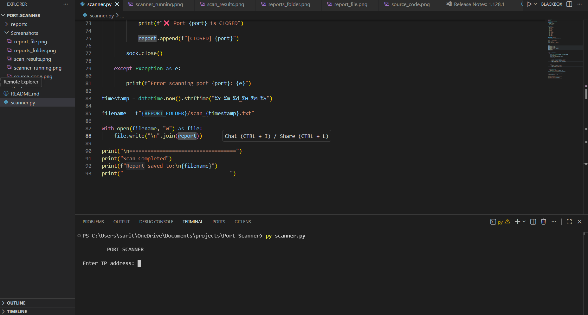
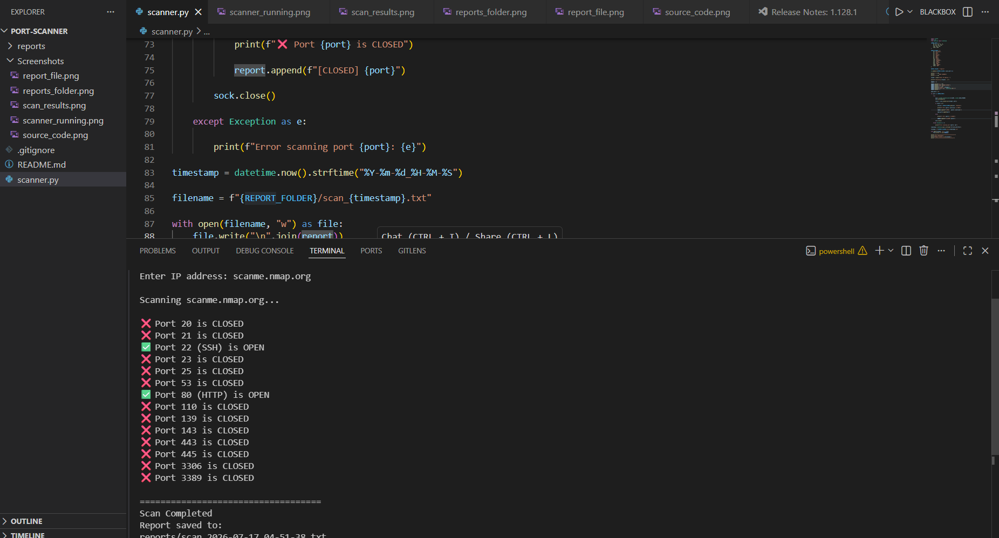
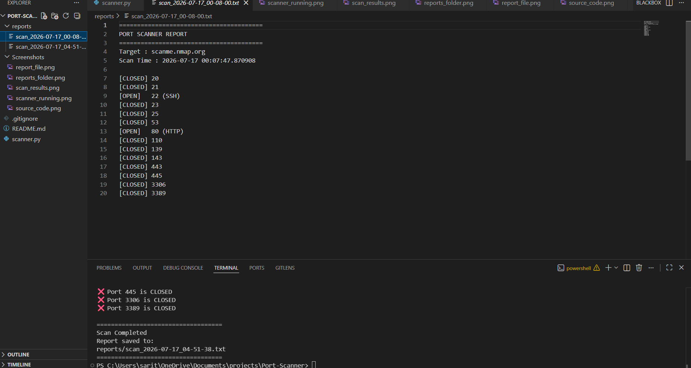

# 🔍 Python Port Scanner

A simple Python-based Port Scanner that checks common TCP ports on a target host and generates a detailed scan report.

---

## 📌 Features

- Scan common TCP ports
- Detect open and closed ports
- Display service names (HTTP, SSH, FTP, etc.)
- Generate timestamped scan reports
- Save reports automatically in a `reports/` folder
- Beginner-friendly Python project

---

## 🛠 Technologies Used

- Python 3
- Socket Programming
- File Handling
- Datetime Module
- OS Module

---

## 📂 Project Structure

```
Port-Scanner/
│
├── scanner.py
├── README.md
├── .gitignore
│
├── reports/
│   └── scan_YYYY-MM-DD_HH-MM-SS.txt
│
└── Screenshots/
    ├── 01_scanner_running.png
    ├── 02_scan_results.png
    ├── 03_reports_folder.png
    ├── 04_report_file.png
    └── 05_source_code.png
```

---

## 🚀 How to Run

Clone the repository:

```bash
git clone https://github.com/Jayeshj12/Port-Scanner.git
```

Go to the project folder:

```bash
cd Port-Scanner
```

Run the scanner:

```bash
python scanner.py
```

Enter the target hostname or IP address when prompted.

Example:

```
Enter IP address: scanme.nmap.org
```

---

## 📷 Screenshots

### Scanner Running



---

### Scan Results



---

### Reports Folder


---

### Generated Report



---

### Source Code


---

## 📄 Sample Report

```
PORT SCANNER REPORT

Target : scanme.nmap.org

[OPEN] 22 (SSH)
[OPEN] 80 (HTTP)
[CLOSED] 443
```

---

## ⚠ Disclaimer

This project was developed for educational and ethical purposes only.

Only scan systems and networks that you own or have explicit permission to test.

---

## 👨‍💻 Author

**Jayesh**

B.Tech Cybersecurity Graduate

Currently learning Python, Computer Networking and Cybersecurity.
